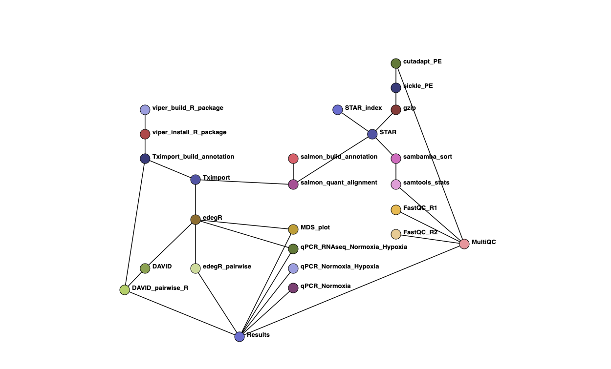

# Viper workflow

**Viper** is a [Snakemake workflow](https://snakemake.readthedocs.io/en/stable/index.html), aimed at performing the RNA-seq workflow of the paper [*'Causes and consequences of a glutamine induced normoxic HIF1 activity for the tumor metabolism'*, Kappler et al. (2019)](https://github.com/GrosseLab/ViperWF) in a reproducible, automated, and partially contained manner. It is implemented such that alternative or similar analysis can be added or removed. 

Viper consists of a `Snakefile` (`workflow/HIF_version_1.0/snakefile`), [`conda`](https://conda.io/docs/) environment files (`envs/*.yaml`), a configuration file (`workflow/HIF_version_1.0/config.yaml`), a set of `R` functions (`R/*R`), and a set of `R` scripts (`scripts/*.R`), to perform quality control, preprocessing, differential expression analysis, and functional annotation of RNA-seq data.

By default, the pipeline performs all the steps shown in the [diagram](img/report_2019_03_14_salmonAlignment_visualization.png) below. However, advanced user, you caneasily modify the `Snakefile` and the `config.yaml` and/or add "custom rules" to enable additional functions. Currently, transcript quantification with `Salmon` at the read-level or gene quantification by [`featureCounts`](http://subread.sourceforge.net) can be activated.

## Workflow graph
This workflow performs differential expression analysis on paired-end RNA-seq data.
After adapter removal with [`Cutadapt`](http://cutadapt.readthedocs.io) and quality filtering with [`sickle`](https://github.com/najoshi/sickle), reads were mapped with [`STAR`](https://github.com/alexdobin/STAR) to the humane genome (GRCh38.82), and transcript counts were quantified with [`salmon`](https://github.com/COMBINE-lab/salmon). 
These transcript counts were summarized to gene counts with [`tximport`](https://github.com/mikelove/tximport). 
Integrated normalization and differential expression analysis were conducted with [`edegR`]( https://bioconductor.org/packages/release/bioc/html/edgeR.html). 
Further, we used the Database for Annotation, Visualization and Integrated Discovery ([`DAVID v6_8`](https://david.ncifcrf.gov/content.jsp?file=citation.html) ) for functional annotation of the differential expressed genes.

  


## Setup the VIPER workflow

Assuming that snakemake and conda are installed (and your system has the necessary libraries to compile R packages), you can use the following commands on a test dataset:

### 0. Step - clone the githup repository
```
git clone https://github.com/GrosseLab/ViperWF.git
```

### 1. Step - Set up the needed folder and copy files from `viper/workflow/HIF_version_1.0`

#### Folder and File Structure 
Here is the basic suggested skeleton for your project folder:

```bash
  .
  ├── data
  │   ├── qPCR 	            # qPRCR raw data
  │   └ *.fastq.gz 	        # all 'fastq.gz'-files from !...!
  │
  ├── references
  │   └── hg38 	    				      # all data from Homo_sapiens.GRCh38.82
  │       ├ Homo_sapiens.GRCh38.82.gtf 	    				          # annotation
  │       ├ Homo_sapiens.GRCh38.dna.primary_assembly.fa 	        # genome sequence 
  │       └ Homo_sapiens.GRCh38.82.EXON.fa 	    				      # exon sequence of all transcript of GTF
  │	
  ├── logs
  ├── report
  │
  ├── viper 	    				      # Github repository 
  │   ├── report 	    				      # Snakemake report definition
  │   ├── wrapper 	    				      # Snakemake wrapper
  │   ├── rules 	    				      # Snakemake rules
  │   ├── scripts 	    				      # Snakemake scripts
  │   ├── workflow 	    				      # Snakemake final workflows
  │   │	  └ HIF_version_1.0 	    				      #
  │   ├── R 	    				      # R functions needed to run the analysis   
  │   └── man 	    				      # R functions manual
  │
  ├── Snakefile 	    				      # file from ./viper/workflow/HIF_version_1.0
  ├── config.yaml 	    				      # file from ./viper/workflow/HIF_version_1.0
  ├── units.tsv 	    				      # file from ./viper/workflow/HIF_version_1.0
  └── samples.tsv 	    				      # file from ./viper/workflow/HIF_version_1.0
```
Make folder and copy files from `viper/workflow/HIF_version_1.0`
```
mkdir data
mkdir data/qpcr
mkdir references
mkdir logs
mkdir report

cp ./viper/workflow/HIF_version_1.0/Snakefile
cp ./viper/workflow/HIF_version_1.0/config.yaml
cp ./viper/workflow/HIF_version_1.0/units.tsv
cp ./viper/workflow/HIF_version_1.0/samples.tsv

cp ./viper/workflow/HIF_version_1.0/copy.csv ./data/qPCR/
cp ./viper/workflow/HIF_version_1.0/qPCR_data.csv ./data/qPCR/
```

### 2. Step - Downlaod data 
Downlaod data from Gene Expression Omnibus (GEO) project [GSExxx](https://www.ncbi.nlm.nih.gov/geo/) using the [NCBI SRA Toolkit](https://trace.ncbi.nlm.nih.gov/Traces/sra/sra.cgi?view=software)
```
download sra-files using the 'SRA Run Selector' or SRA Toolkit from https://www.ncbi.nlm.nih.gov/geo/query/XXXX
convert *.sra fiels to *.fastq.gz files usnig fastq-dump form SRA Toolkit 
```

### 3. Step - run snakmake
```
snakemake -kn 
snakemake --create-envs-only   --use-conda
snakemake -k -p --use-conda -j 20
```

new Folder `results`
```bash
  .
  ├── data
  ├── references
  ├── report 
  ├── viper 	    				      # Github repository 
  │
  ├── logs # include loggings of the snakemake rules   
  ├── results # new folder for the results of the snakemake rules   
  │
  ├── Snakefile 	    				     
  ├── config.yaml 	    				     
  ├── units.tsv 	    				     
  └── samples.tsv 	    				     
```


######### useful
[Markdown-Cheatsheet](https://github.com/adam-p/markdown-here/wiki/Markdown-Cheatsheet)
[folder](https://github.com/aerobatic/markdown-content/blob/master/docs/directory-structure.md)


